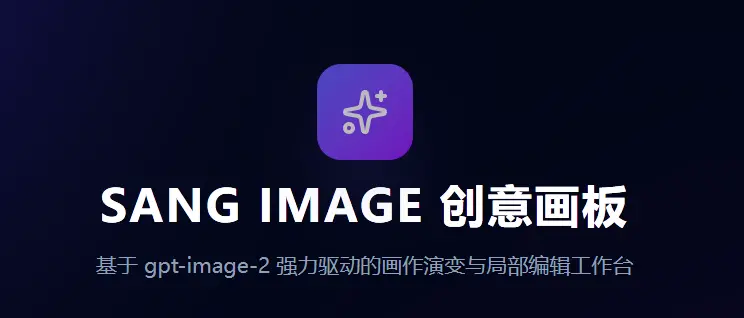
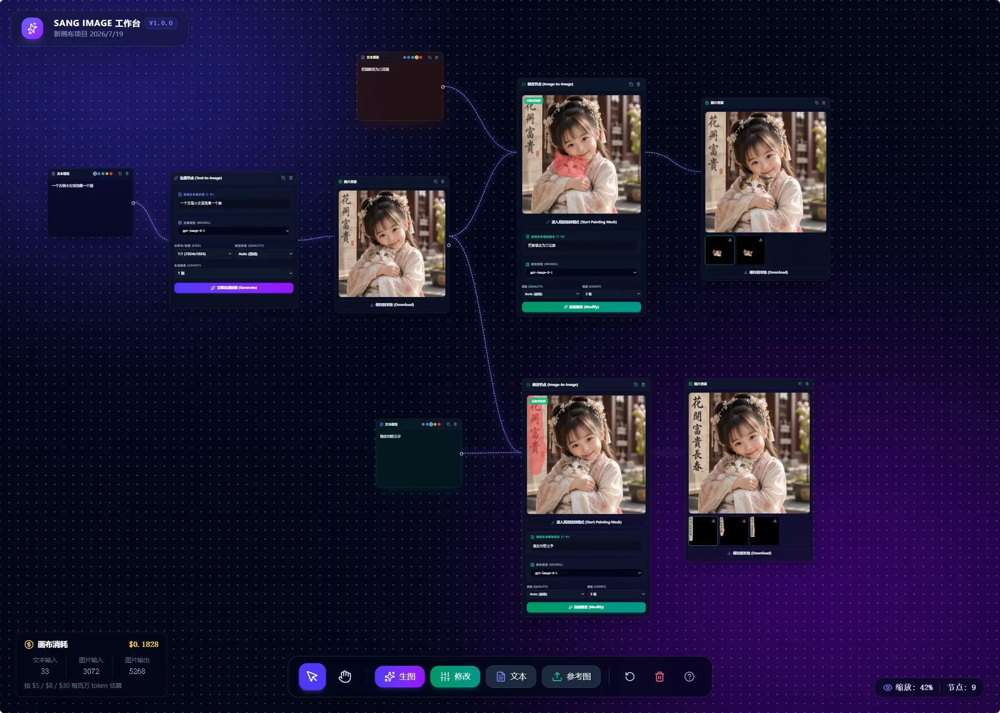

# Sang Image 创意画板

基于 React、Vite 和 Tauri 的无限画布式 AI 图像工作台。通过节点、连线和画布布局组织文本生图、参考图生图与局部重绘流程，并将项目、图片资产和 API 配置保存在浏览器本地。



## 功能



- 多项目画布：创建、切换、删除项目，自动保存节点、连线与视图位置。
- 文本生图：支持提示词、尺寸、模型、质量和一次生成多张图片。
- 参考图生图：上传图片或粘贴剪贴板图片，将图片节点连接至生图节点。
- 局部编辑：在编辑节点中基于原图和蒙版调用图像编辑接口。
- 节点工作流：可添加文本、图片、生图与编辑节点，通过连线组织输入和输出关系。
- 接入点管理：可为不同 OpenAI 兼容服务配置名称、Base URL、API Key 与模型列表，并指定默认接入点。
- 本地资产管理：生成图、上传图和蒙版保存至 IndexedDB；项目配置与画布状态保存至 LocalStorage。
- 操作日志：提供独立的“操作日志”页面，记录项目管理、节点编辑、图像生成与局部编辑等关键操作及结果。
- 画布消耗统计：画布左下角展示当前项目的输入/输出 token 和预计费用；基于图像接口响应的 `usage` 累计，删除或清空节点不会减少已记录消耗。

## 技术栈

- React 19 + TypeScript
- Vite + Tailwind CSS
- OpenAI 兼容 Images API

## 环境要求

- Node.js 18 或更高版本。
- 一个支持 `/images/generations` 和 `/images/edits` 的 OpenAI 兼容图像服务，且该服务须允许应用页面或 Tauri WebView 的跨域请求（CORS）。

## 快速开始

安装依赖：

```bash
npm install
```

启动开发服务器：

```bash
npm run dev
```

服务默认监听 `http://localhost:3000`。图像请求由浏览器直接发送到接入点配置的 Base URL。

## 配置图像服务

应用使用当前节点选中接入点的浏览器设置；默认 Base URL 为 `https://api.openai.com/v1`。

### 方式一：在界面中配置

进入首页的“设置”，添加或编辑接入点：

- 接入点名称：用于画布和节点中的识别。
- Base URL：例如 `https://api.openai.com/v1`，末尾斜杠会被自动处理。
- API Key：调用上游服务所需的密钥。
- 模型列表：用英文逗号分隔，例如 `gpt-image-2, gpt-image-1`。

界面配置仅保存在当前浏览器的 LocalStorage。应用使用浏览器的 `fetch` 直接请求 `${Base URL}/images/generations` 或 `${Base URL}/images/edits`，并在请求头中携带 `Authorization: Bearer <API Key>`。不会启动、使用或转发到本地 Node.js 服务。

## 画布使用

1. 在首页新建或打开一个项目。
2. 使用底部工具栏添加生图、修改、文本或参考图节点；也可以在空白画布双击添加生图节点。
3. 从文本或独立图片节点的连接控制点拖到生图或编辑节点，建立输入关系。
4. 在节点内选择接入点、模型、尺寸和数量，填写提示词后提交生成或编辑任务。
5. 生成结果会以图片节点形式出现在源节点右侧，并自动建立连线。

常用操作：

| 操作 | 快捷方式 |
| --- | --- |
| 选择工具 | `V` |
| 抓手工具 | `H` |
| 临时平移 | 按住 `Space` 并拖拽 |
| 缩放画布 | 鼠标滚轮或触控板缩放手势 |
| 重置视角 | `R` |
| 新建生图节点 | 双击空白画布 |

## 数据与隐私

- 项目、节点、连线和接入点配置保存在 LocalStorage。
- 图片与蒙版二进制数据保存在 IndexedDB；资产管理页面可查看和删除图片资产。
- 操作日志保存在 LocalStorage 的 `gpt_image_operation_logs` 中，最多保留最近 500 条；日志不包含 API Key、提示词、图片或项目内容。
- 每个项目的累计消耗随项目配置保存在 LocalStorage。预计费用按输入文本 $5、输入图片 $8、输出图片 $30 / 1M tokens 计算；当前响应未提供缓存 token，因此缓存输入费用不计入估算。
- 清除浏览器站点数据会删除本地项目、配置与资产。
- 在界面中填写的 API Key 会保存在该浏览器的 LocalStorage，且仅由浏览器在调用所配置接入点时发送。请仅在受信任设备和受信任的应用构建中保存 API Key。

## 直接 API 调用

文本生图使用 JSON 请求 `${Base URL}/images/generations`；参考图生图和局部编辑使用 `multipart/form-data` 请求 `${Base URL}/images/edits`。生成接口的 `b64_json` 响应会保存在浏览器本地，URL 响应则要求图片地址也允许跨域读取。

## 构建与部署

执行生产构建：

```bash
npm run build
```

该命令将 Vite 前端输出到 `dist/`。使用以下命令预览：

```bash
npm start
```

预览服务默认监听 4173 端口；生产部署可使用任意静态文件服务器托管 `dist/`。

## 开发命令

```bash
npm run dev    # 启动 Vite 开发服务
npm run lint   # 执行 TypeScript 类型检查
npm run build  # 构建前端
npm start      # 预览生产构建产物
```


## 参考资料

- [Azure OpenAI Image Generations / Edits API](https://learn.microsoft.com/en-us/azure/foundry/openai/reference-preview#image-generations---edit)
- [Azure OpenAI pricing](https://azure.microsoft.com/en-us/pricing/details/azure-openai/)